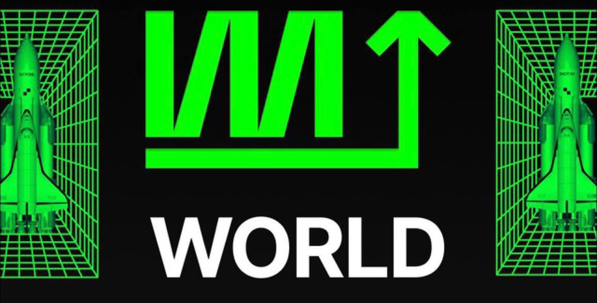

# PatternCV

шаблон использования модели для CV задач

## Полученные маски на тестовом датасете

### image 000

### image 001

### image 002

### image 003

### image 004

### image 005

### image 006

### image 007

